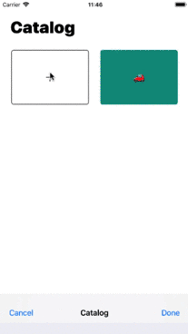

# Random.Me

This simple app acts itself as a randomizer or as a decision-maker in some cases. By giving a set of choices, the decision can be made by luck over those available choices. Furthermore, each choice can be active or inactive in order to become hidden to the randomizer.

## Dependencies:
* [RealmSwift](https://realm.io/docs/swift/latest/) – an alternative database to SQLite and Core Data
* [Eureka](https://eurekacommunity.github.io/) – elegant iOS form builder in Swift
* [SwiftIconFont](https://github.com/0x73/SwiftIconFont) – vector icon fonts for iOS

## Requirements:
* iOS 11.0+
* XCode 9+
* Swift 4

## Example

<table>
  <tr>
    <th>
      
    </th>
    <th>
      
    </th>
  </tr>
</table>
